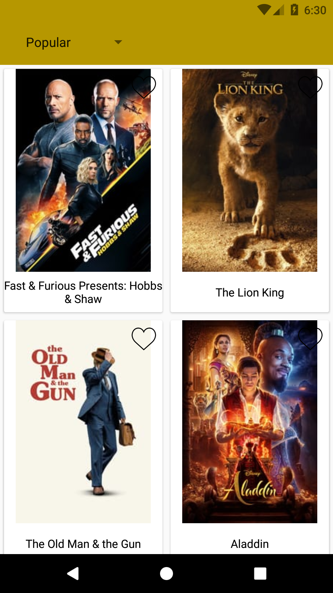
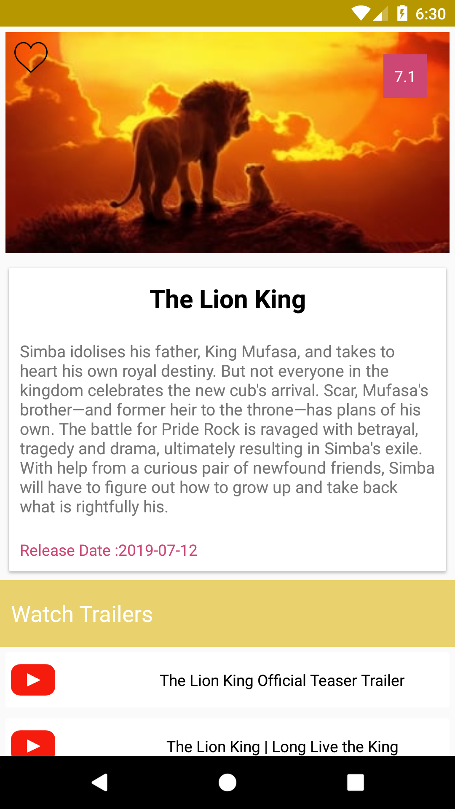

# MovieAPI
An android application created using third party API to show popular movies,ratings,trailers etc.

**Third party libraries used:**

   * [Retrofit](https://square.github.io/retrofit/)
   * [Picasso](https://github.com/square/picasso)
   * [Butterknife](https://github.com/JakeWharton/butterknife)
   
   **Here are the screenshots:**
   
   
   
   
